# 01 — Pipeline Diagram (end-to-end)

> Companion docs: [02-catalog-and-model.md](./02-catalog-and-model.md) · [03-quality-monitoring.md](./03-quality-monitoring.md)
> Existing adjacent docs (trackers, not catalogs): [../data-quality.md](../data-quality.md) · [../architecture-modelling.md](../architecture-modelling.md)

This document is the **topological map** de la data platform : chaque source → chaque ingest → chaque couche dbt → chaque JSON exporté → chaque page UI.

**Trois niveaux de zoom**, du conceptuel au détail :

- [§0a — L0 conceptual view](#0a-l0--conceptual-view) : 8 boîtes, vue d'ensemble en une lecture
- [§0b — L1 master overview](#0b-l1--master-overview) : tous les scripts/marts/JSONs nommés (page dense, pour cherche-rapide)
- [§1](#1-budget-domain)–[§9](#9-national--comparative-benchmark-domain-partial) : L1 par domaine (un par diagramme)
- **L2** : `dbt docs generate && dbt docs serve` ouvre le lineage natif au modèle près

---

## 0a. L0 — Vue conceptuelle

Le pipeline transforme des **sources publiques** (OpenData Paris, data.gouv.fr, PDFs CDN, scrape Conseil de Paris, enrichissements LLM) en **fichiers JSON** servis par un site Next.js. Trois couches simples :

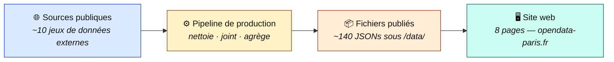

### Règles invariantes

1. **Aucune donnée affichée n'est produite hors du pipeline.** Tout chiffre visible dans l'UI vient d'un fichier sous `website/public/data/`, lui-même généré par un script `export_*.py` qui lit BigQuery. Pas de chemin direct.
2. **Le pipeline est traçable bout-en-bout.** Chaque chiffre doit pouvoir être suivi du JSON publié → mart BigQuery → modèle dbt → table source brute → script d'ingest → URL OpenData externe.
3. **L'audit est automatisé** (cf. [04-layering-convention.md](./04-layering-convention.md)). Une PR qui violerait la chaîne ci-dessus est refusée par CI.

### Ce qui se passe dans « Pipeline de production »

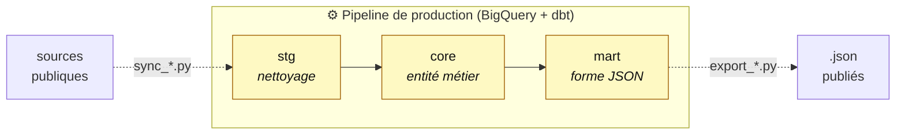

**stg / core / mart** sont les trois couches dbt (les noms suivent la convention dbt) :
- **stg** = chaque source nettoyée (renommage, typage, filtres triviaux). 1 stg = 1 source.
- **core** = entité métier. Joint plusieurs stg + référentiels pour produire l'entité canonique (exemple : `core_subventions`).
- **mart** = forme finale prête à être sérialisée en JSON pour 1 page UI.

### Cas spécial : enrichissements LLM/scrape

Les **vulgarisations LLM**, **lookups SIRENE**, **scrape PDF** et **photos** ne sont pas idempotents (deux runs ne donnent pas le même résultat). Ils suivent un chemin parallèle :

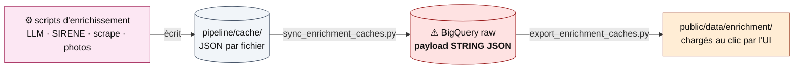

**⚠️ Limite explicite** : la table BigQuery `raw.enrichment_caches_paris` stocke les payloads **en STRING JSON, pas en colonnes typées**. Donc :
- BigQuery ne valide PAS la structure interne d'un payload (un champ manquant n'erreure pas).
- Trois tests singular (`pipeline/tests/cat10_enrichment_quality/enrich_caches_*.sql`) compensent partiellement : présence des caches attendus, parsing JSON valide, champs racine `items`/`generated_at` présents.
- Si un cache devient critique pour le first-paint UI, il doit être promu en pipeline typé (raw → stg colonnes typées → mart). Voir [ADR-0004](../decisions/0004-polymorphic-vs-typed-caches.md) pour le compromis détaillé.

Pour les détails (qui produit quoi, quel mart alimente quel JSON, quel UI page consomme quoi), voir §0b et §1-§9.

---

## 0b. L1 — Master overview

High-level shape: sources → ingest → BigQuery `raw.*` (+ seeds/caches for non-API paths) → dbt (stg → core → int → mart) → export scripts → JSON files → Next.js UI.

```mermaid
flowchart LR
    subgraph SOURCES["🌐 Raw sources"]
        OD[OpenData Paris API]
        DGF[data.gouv.fr DECP]
        PDF[cdn.paris.fr PDFs<br/>Budget voté · Annexe IL]
        DELIBS[a06-v7.apps.paris.fr<br/>Deliberations HTML+PDF]
        SIRENE[recherche-entreprises<br/>INSEE SIRENE]
        WEB[Web search<br/>Wikipedia FR]
        SEEDS[(Seeds CSV<br/>editorial params<br/>thematiques mapping<br/>DRIHL xlsx)]
    end

    subgraph INGEST["⬇️ Ingest"]
        SYNC[sync_opendata.py]
        FDECP[fetch_decp_paris.py]
        FSUB[fetch_subventions_opendata.py]
        EPDF_B[extract_pdf_budget_vote.py]
        EPDF_I[extract_pdf_investments.py]
        SDEL[scrape_deliberations.py]
        UPLD[upload_bilan_comptable.py]
        SDET[sync_dette_garantie.py]
    end

    subgraph CACHE["💾 Internal cache<br/>pipeline/cache/"]
        CACHE_SUBV[(subventions_pre_enrichment/<br/>beneficiaires_*.json<br/>treemap_*.json)]
        CACHE_INV[(pdf_invest/<br/>investissements_localises_*.json)]
        CACHE_DEL[(delibs/sessions/<br/>session_*.json)]
        CACHE_ENR[(enrichment/<br/>17 caches LLM/SIRENE/photos)]
        CACHE_WIP[(wip/<br/>communes-all/, national/, …)]
    end

    subgraph SYNC2_BOX["⬇️ Cache → BQ (sync polymorphe)"]
        SYNC2[sync_pdf_investissements_localises<br/>sync_deliberations<br/>sync_enrichment_caches<br/>sync_sirene_companies<br/>sync_dette_garantie]
    end

    subgraph BQ["🗄️ BigQuery raw.*"]
        RAW[(raw.comptes_administratifs_*<br/>raw.subventions_*<br/>raw.liste_des_marches_*<br/>raw.decp_marches_paris<br/>raw.logements_sociaux_*<br/>raw.bilan_comptable<br/>raw.dette_garantie_paris)]
    end

    subgraph DBT["🧪 dbt pipeline/models"]
        STG[staging/<br/>stg_* × 26<br/><i>tous les seeds wrappés</i>]
        CORE[core/<br/>core_* × 12<br/><i>OBT enrichis inline</i>]
        INT[intermediate/<br/>int_* × 1<br/><i>cross-domain post-core uniquement</i>]
        MART[marts/<br/>mart_* × 24]
    end

    subgraph ENRICH["🤖 Enrichment<br/>pipeline/scripts/enrich/"]
        LLM[LLM scripts<br/>thematique · grounded · vulgarize<br/>geo_ap · deliberations]
        DETER[Deterministic<br/>sirene · match · patrimoine<br/>hors_bilan · photos]
        CACHES[(seeds/seed_cache_*.csv<br/>public/data/enrichment/*.json)]
    end

    subgraph EXPORT["📤 Export<br/>pipeline/scripts/export/"]
        EXP[export_* × 13]
    end

    subgraph JSONS["📦 website/public/data/*.json<br/>~140 files"]
        J_META[data_availability.json<br/>methodology.json]
        J_BUDGET[budget_sankey_* · budget_nature_*<br/>evolution_budget · vote_vs_execute]
        J_SUB[subventions/*<br/>subventions_delibs/*]
        J_MARCH[marches-publics/*]
        J_MAP[map/investissements_*<br/>map/arrondissements_stats_*<br/>map/logements_*]
        J_BILAN[bilan_sankey_* · patrimoine_structure_*<br/>hors_bilan_*]
        J_ENR[enrichment/*.json]
    end

    subgraph UI["🖥️ Next.js UI<br/>website/src/app"]
        P_LAND[/ LandingClient/]
        P_BUD[/budget BudgetClient/]
        P_QR[/qui-recoit Explorer/]
        P_MP[/marches-publics Search/]
        P_INV[/investissements/]
        P_LOG[/logement-social/]
        P_DET[/dette-patrimoine/]
        P_MET[/methode/]
    end

    OD --> SYNC --> RAW
    OD --> FSUB --> CACHE_SUBV
    DGF --> FDECP --> RAW
    PDF --> EPDF_B --> SEEDS
    PDF --> EPDF_I --> CACHE_INV
    DELIBS --> SDEL --> CACHE_DEL
    UPLD --> RAW
    SEEDS --> STG
    RAW --> STG
    STG --> CORE
    CORE --> INT
    CORE --> MART
    INT --> MART
    MART --> EXP

    SIRENE --> LLM
    WEB --> LLM
    LLM --> CACHES
    DETER --> CACHES
    CACHE_SUBV --> LLM
    CACHE_SUBV --> DETER
    CACHE_INV --> SYNC2
    CACHE_DEL --> SYNC2
    CACHES --> SYNC2
    SYNC2 --> RAW

    EXP --> JSONS
    J_BUDGET --> P_LAND & P_BUD
    J_SUB --> P_QR
    J_MARCH --> P_MP
    J_MAP --> P_INV & P_LOG
    J_BILAN --> P_DET
    J_ENR --> P_QR & P_MP & P_INV
    J_META --> P_MET & P_LAND

    classDef src fill:#dbeafe,stroke:#1e40af,color:#111
    classDef ing fill:#dcfce7,stroke:#166534,color:#111
    classDef bq fill:#fef3c7,stroke:#92400e,color:#111
    classDef dbt fill:#e0e7ff,stroke:#3730a3,color:#111
    classDef enr fill:#fce7f3,stroke:#9d174d,color:#111
    classDef exp fill:#f3e8ff,stroke:#6b21a8,color:#111
    classDef json fill:#ffedd5,stroke:#9a3412,color:#111
    classDef ui fill:#ccfbf1,stroke:#115e59,color:#111
    classDef cache fill:#f1f5f9,stroke:#475569,color:#111
    class OD,DGF,PDF,DELIBS,SIRENE,WEB,SEEDS src
    class SYNC,FDECP,FSUB,EPDF_B,EPDF_I,SDEL,UPLD,SDET ing
    class SYNC2 ing
    class RAW bq
    class STG,CORE,INT,MART dbt
    class LLM,DETER,CACHES enr
    class EXP exp
    class J_META,J_BUDGET,J_SUB,J_MARCH,J_MAP,J_BILAN,J_ENR json
    class P_LAND,P_BUD,P_QR,P_MP,P_INV,P_LOG,P_DET,P_MET ui
    class CACHE_SUBV,CACHE_INV,CACHE_DEL,CACHE_ENR,CACHE_WIP cache
```

**Layering rule and audit gate.** The shape above respects `raw → stg → core → (int) → mart → export → JSON` with **no shortcut anywhere**. Zero dotted arrows: every byte under `website/public/data/` is produced by an export script reading a `mart_*`. Audit gate: `python pipeline/scripts/audit/check_layering.py --strict` returns exit 0 with **0 violations and 0 warnings**.

**Internal cache pattern (Phases 8-12 of the layering refactor).** Scripts that legitimately produce intermediate artifacts (PDF extraction, scraping, LLM enrichment, WIP exploration) write to `pipeline/cache/`, never directly to `public/data/`. A polymorphic family of `sync_*` scripts uploads each cache file to `raw.*`, dbt builds stg → core → mart, and dedicated `export_*` scripts publish the public JSONs.

| Cache | Sync script | Mart | Export |
|---|---|---|---|
| `cache/subventions_pre_enrichment/` | (read by enrichment chain) | feeds `mart_subventions_*` via seeds | `export_subventions_data.py` |
| `cache/pdf_invest/` | `sync_pdf_investissements_localises.py` | `mart_investissements_localises` | `export_investissements_localises.py` |
| `cache/delibs/sessions/` | `sync_deliberations.py` | `mart_deliberations` | `export_deliberations.py` |
| `cache/enrichment/` (17 files) | `sync_enrichment_caches.py` | `mart_enrichment_caches` (polymorphic) | `export_enrichment_caches.py` |
| `cache/wip/` | (TBD when wired into UI) | TBD | TBD |

See [04-layering-convention.md](./04-layering-convention.md) for the full convention and [_layering_refactor_tracker.md](./_layering_refactor_tracker.md) for the refactor history.

**Orchestrators:**
- Full pipeline: [pipeline/scripts/tools/run_pipeline.py](../../pipeline/scripts/tools/run_pipeline.py)
- Enrichment only: [pipeline/scripts/enrich/run_enrichment.py](../../pipeline/scripts/enrich/run_enrichment.py)
- Export only: [pipeline/scripts/export/export_all.py](../../pipeline/scripts/export/export_all.py)

---

## 1. Budget domain

Two parallel pipelines: **executed** (CA, from OpenData M57) and **voted** (BP, from PDF Budget Général). They are reconciled by `mart_vote_vs_execute`.

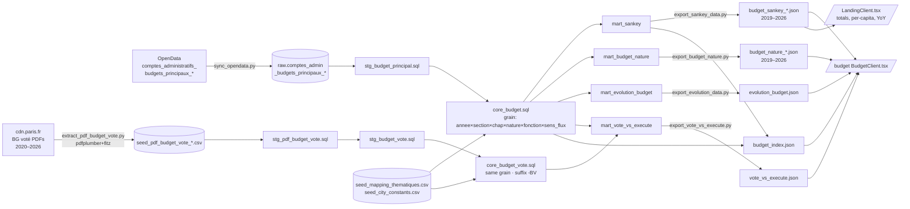

**Key facts:**
- `core_budget` covers 2019–2024 (executed/CA). `core_budget_vote` covers 2019–2026 (voted, 2025–2026 = forecast).
- `budget_sankey_2026.json` is **vote-only** (no CA yet); the JSON carries a `dataStatus` flag.
- Thematic classification on budget lines is **deterministic** (seed `seed_mapping_thematiques.csv` keyed by `chapitre × fonction`), not LLM-based. This is unlike subventions.

---

## 2. Subventions domain

Three sources merged: OpenData "Votées" (rich, associations only), OpenData "Annexe CA" (broad, minimal fields), and scraped deliberations (current year, article-level).

```mermaid
flowchart LR
    S1[OpenData<br/>subventions-associations-<br/>votees-*] -->|fetch_subventions_<br/>opendata.py| S2
    S3[OpenData<br/>subventions-versees-<br/>annexe-CA-*] --> S2
    S2[Merge votées ∪ annexe CA<br/>by year+normalized name]
    S2 -->|direct JSON emit<br/>bypass BQ| S4[(beneficiaires_*.json<br/>raw form, pre-enrichment)]
    S2 --> RAWS[(raw.subventions_*)]
    RAWS --> STGS[stg_subventions_all.sql<br/>stg_associations.sql]
    STGS --> CS[core_subventions.sql<br/>~53k rows 2018–2024<br/>skip 2020–2021 anonymized]

    D1[a06-v7 HTML+PDF] -->|scrape_deliberations.py<br/>pypdf+regex| D2[cache/delibs/pdf/]
    D2 -->|enrich_deliberations_llm.py<br/>+ _sirene + _websearch| D3[(subventions_delibs/<br/>session_*.json)]
    D3 -->|apply_deliberation_results.py| CS

    CS --> EN1[enrich_thematique_llm.py<br/>Gemini 3 Flash · Pareto 500]
    EN1 --> CACHE1[(seed_cache_thematique_<br/>beneficiaires.csv)]
    CS --> EN2[enrich_beneficiaire_<br/>grounded_llm.py<br/>Claude Haiku 4.5 + web_search]
    EN2 --> CACHE2[(enrichment/<br/>beneficiaire_grounded.json)]
    CS --> EN3[enrich_sirene.py<br/>recherche-entreprises API]
    EN3 --> CACHE3[(enrichment/<br/>sirene_companies.json)]
    CS --> EN4[vulgarize_subventions_llm.py<br/>LLM]
    EN4 --> CACHE4[(enrichment/<br/>vulgarization_subventions.json)]

    CACHE1 --> IE[int_subventions_enrichies.sql]
    CS --> IE
    IE --> MT[mart_subventions_treemap]
    IE --> MB[mart_subventions_beneficiaires]
    MT -->|export_subventions_data.py| JT[subventions/treemap_*.json<br/>2018–2019, 2022–2024]
    MB -->|export_subventions_data.py| JB[subventions/beneficiaires_*.json]
    JB --> JS[subventions/<br/>beneficiaires_search.json]
    JT & JB & JS --> UIQ[/qui-recoit<br/>QuiRecoitExplorer/]
    CACHE2 & CACHE3 & CACHE4 -->|lazy-load per click| UIQ
    D3 --> UIQ
```

**Grain notes:**
- `core_subventions` grain = (année, beneficiaire_normalise, collectivité) rolled up from raw (année, ligne, titre).
- `beneficiaires_*.json` = one row per (année, bénéficiaire), carries `montant_total`, `nb_subventions`, `source_thematique ∈ {pattern, direction, llm, default}`.
- **No geolocation** on subventions by design — see `architecture-modelling.md §Enrichissement` and the caveat in [03-quality-monitoring.md](./03-quality-monitoring.md).

---

## 3. Marchés publics domain

Dual-source merge (OpenData Paris + DECP national) with fallback join strategy and dual-amount display logic.

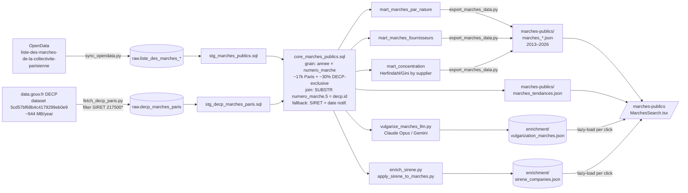

**Domain rules baked in:**
- `afficher_deux_montants` flag: true if |`montant_notifie` − `montant_max`| / `montant_max` > 5% (threshold in `seed_editorial_params.csv`).
- Coverage gap: ~45% of contracts are in only one of the two sources (~55% overlap per `architecture-modelling.md`). We keep the **superset**.
- Missing dimension: `lieu_execution` from DECP is department-level only (code 75), not arrondissement.

---

## 4. Investments / Autorisations de Programme domain

Two sources, one frozen (API, 2018–2022) and one PDF-extracted via Gemini 3 Flash vision (2023–2024), geocoded via a 4-level cascade.

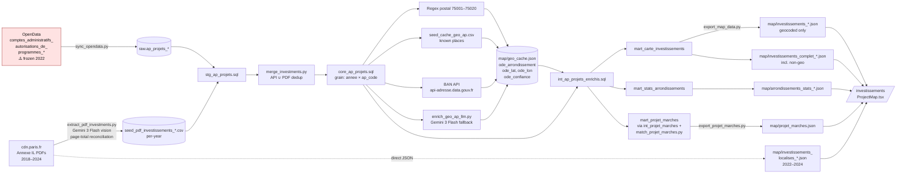

**Geo confidence scoring** (written to each row):
- Regex / known place → 1.0
- BAN API → score returned by API
- LLM inference → 0.5–0.95 (`ode_confiance` field)
- 20–30% of projects have `ode_arrondissement IS NULL` (dotations centrales, études pluri-sites)

---

## 5. Logement social domain

Two parallel lanes: **financed stock** (OpenData, 2001–2024) and **waitlist pressure** (DRIHL Excel seed, 2024 snapshot).

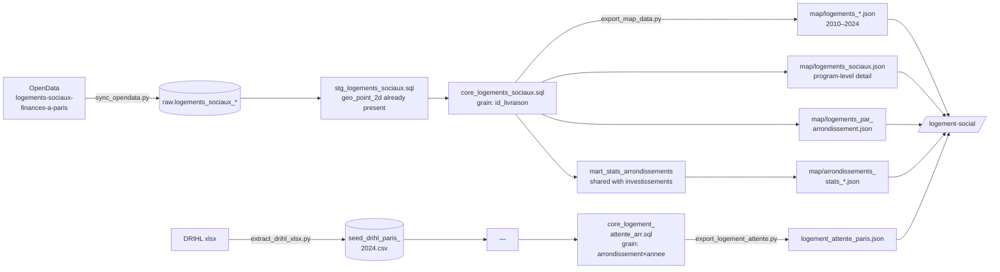

**Quality check:** `check_drihl_ratio.py` validates occupancy ratios and density; results are consumed by `completeness_logements_geolocated.sql` (100% expected since source carries geo_point_2d).

---

## 6. Balancesheet / debt domain

Hand-loaded CSV for the balancesheet, plus enrichment scripts that annotate debt structure and off-balance items.

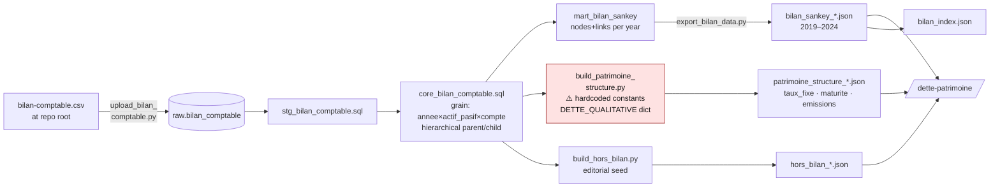

**⚠️ Known limitation:** `patrimoine_structure_*.json` uses **constant** debt ratios across 2019–2024 (indicative only — from 2024 ROB + CRC). See caveats register in [03-quality-monitoring.md §H6](./03-quality-monitoring.md).

---

## 7. Metadata & methodology channel

Two JSON files power the audit trail that the UI (`/methode` page) and every per-metric tooltip rely on.

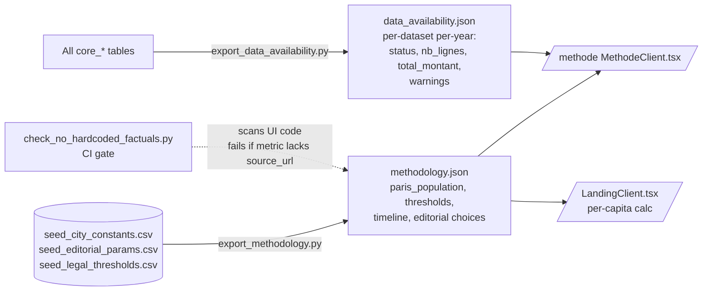

**Hard rule:** every numeric metric in the UI must trace back to an entry in `methodology.json` carrying `source` + `source_url`. The audit script [pipeline/scripts/audit/check_no_hardcoded_factuals.py](../../pipeline/scripts/audit/check_no_hardcoded_factuals.py) enforces this at build time.

---

## 8. Enrichment subsystem (cross-domain)

Enrichment is a **side-car** pipeline that reads core tables and writes cache files consumed by both dbt models (via seeds) and the UI (via `website/src/lib/fusion-data.ts` loaders).

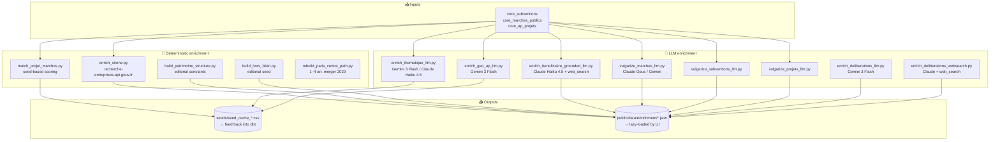

**Orchestrator:** [pipeline/scripts/enrich/run_enrichment.py](../../pipeline/scripts/enrich/run_enrichment.py) runs these in sequence with logging.

See [03-quality-monitoring.md §LLM audit trail](./03-quality-monitoring.md) for model versions, confidence scoring, and test specs per enrichment script.

---

## 9. National / comparative benchmark domain (partial)

Separate dbt sub-project for comparing Paris against other French cities. Covered in [pipeline/models/national/](../../pipeline/models/national/) and [pipeline/scripts/sync/sync_national.py](../../pipeline/scripts/sync/sync_national.py). Not yet surfaced in the main UI pages — treated as a future doc.

---

## Maintenance

When you add or rename:
- a **sync script** → update §0 + relevant domain graph (§1–§6)
- a **dbt model** → update the domain graph it belongs to (stg/core/int/mart layer box)
- an **export script or JSON file** → update the JSON box + the UI consumer edge
- an **enrichment script** → update §8

Rendering: any markdown previewer that supports Mermaid (VS Code + Markdown Preview Mermaid Support, GitHub, GitLab). CLI render: `mmdc -i 01-pipeline-diagram.md -o pipeline.svg` via `@mermaid-js/mermaid-cli`.
